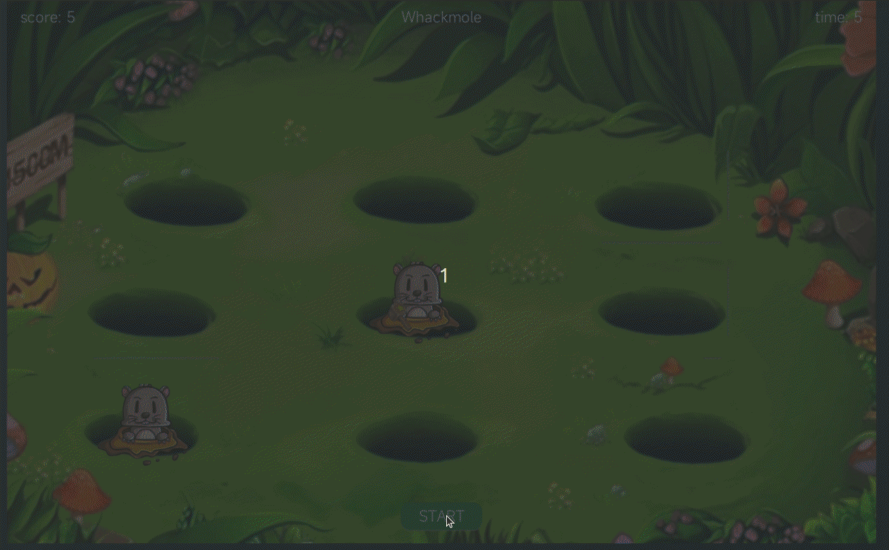

# 打地鼠 Demo 快速上手

\[ [English](./README.md)  | 简体中文 \]

本文档详细介绍如何在 openvela 系统上为 QEMU 模拟器和 ESP32-S3-BOX 开发板构建、部署和运行 Whack-a-Mole（打地鼠）演示应用程序。您将学习如何配置项目、编译固件、运行应用，并对游戏功能进行自定义修改。

## 一、运行效果



## 二、构建与运行

本节将指导您完成从项目配置到在目标平台上运行应用程序的完整流程。

### 准备工作

在开始之前，请确保您已位于 `openvela` 仓库的根目录下。本文中的所有命令均以此为起点。

### 步骤 1：配置项目

您需要通过 `menuconfig` 工具来启用 Whack-a-Mole 应用并进行相关设置。

1. 启动 `menuconfig`。请根据您的目标平台选择对应的命令：

    - QEMU 模拟器:

        ```Bash
        ./build.sh vendor/openvela/boards/vela/configs/goldfish-armeabi-v7a-ap menuconfig
        ```

    - ESP32-S3-BOX:

        ```Bash
        ./build.sh nuttx/boards/xtensa/esp32s3/esp32s3-box/configs/lvgl-3 menuconfig
        ```

2. 在 `menuconfig` 界面中，按 `/` 键打开搜索功能，查找并启用以下配置项：

    ```Bash
    LVX_USE_DEMO_WHACKMOLE=y
    LVX_WHACKMOLE_DATA_ROOT="/data"
    ```

3. **（可选）** 如果您在运行时遇到界面卡顿或显示不流畅的问题，可以尝试增加 LVGL (Light and Versatile Graphics Library) 的缓存大小。搜索 `lv_cache_def_size` 并将其值设置为 `20000000`。

4. 保存配置并退出 `menuconfig`。

### 步骤 2：编译项目

编译前，建议先清理旧的构建产物以避免潜在的构建错误。

1. 清理构建产物 (distclean):

    - QEMU 模拟器:

        ```Bash
        ./build.sh vendor/openvela/boards/vela/configs/goldfish-armeabi-v7a-ap distclean -j8
        ```

    - ESP32-S3-BOX:

        ```Bash
        ./build.sh nuttx/boards/xtensa/esp32s3/esp32s3-box/configs/lvgl-3 distclean
        ```

2. 执行构建:

    - QEMU 模拟器:

        ```Bash
        ./build.sh vendor/openvela/boards/vela/configs/goldfish-armeabi-v7a-ap -j8
        ```

    - ESP32-S3-BOX:

        ```Bash
        ./build.sh nuttx/boards/xtensa/esp32s3/esp32s3-box/configs/lvgl-3 -j8
        ```

### 步骤 3：部署与运行

编译成功后，您可以将固件部署到目标平台并启动应用。

#### 选项 A：在 QEMU 模拟器中运行

1. 在 `openvela` 根目录，执行以下命令启动模拟器：

    ```Bash
    ./emulator.sh vela
    ```

2. 等待 openvela 终端（`openvela-ap>`）出现后，输入以下命令启动游戏：

    ```Bash
    Whackmole
    ```

#### 选项 B：在 ESP32-S3-BOX 开发板上运行

1. 烧录固件：

    确保您的 ESP32-S3-BOX 已通过 USB 连接到计算机。执行以下命令开始烧录。请将 `/dev/ttyACM0` 替换为您的设备实际的串口端口号。

    ```Bash
    pushd nuttx && make -j8 flash ESPTOOL_PORT=/dev/ttyACM0 ESPTOOL_BINDIR=./ && popd
    ```

2. 打开串口监视器：

    使用 `minicom` 或其他串口工具来查看设备输出并与之交互。

    ```Bash
    sudo minicom -D /dev/ttyACM0 -b 115200
    ```

3. 启动游戏：

    在 `minicom` 的终端中，输入以下命令：

    ```Bash
    Whackmole
    ```

## 三、应用定制

您可以根据需求修改游戏的核心功能，例如替换资源或调整难度。

### 核心文件结构

- `Whackmole.c`: 包含游戏的核心逻辑。所有功能开发和修改都应在此文件中进行。
- `Whackmole_main.c`: 作为应用程序的入口，负责创建并启动运行游戏逻辑的任务。通常情况下，您无需修改此文件。

### 修改资源图片

游戏使用的图片和字体资源被转换为 C 数组，并直接编译到固件中。

- **资源路径**: 资源文件位于 `pic/` 目录下。
- **转换工具**: 您可以使用 [LVGL 官方在线转换器](https://lvgl.io/tools/imageconverter) 将您自己的图片或字体文件转换为所需的 C 格式。
- **替换**: 生成新的 C 文件后，替换 `pic/` 目录下的旧文件并重新编译项目。

### 调整游戏难度

游戏难度由地鼠出现的频率决定，该频率由一个定时器控制。

在 `pop_random_mole` 函数中，游戏会根据剩余时间 `game_time` 动态调整定时器的周期。周期越短，地鼠出现越快，难度越高。

```C
// Gophers appear randomly
static void pop_random_mole(lv_timer_t *timer) {
    // ... (代码省略) ...
    
    // Adjust the frequency of gophers
    if (game_time < 40) {
        lv_timer_set_period(timer, 800);  // 周期设置为 800 毫秒
    }
    if (game_time < 20) {
        lv_timer_set_period(timer, 600);  // 周期设置为 600 毫秒
    }
}
```

要调整游戏难度，您可以修改 `lv_timer_set_period` 函数的第二个参数值。

- **降低难度**: 增大周期值（例如，`1000` 毫秒）。
- **增加难度**: 减小周期值（例如，`500` 毫秒）。
