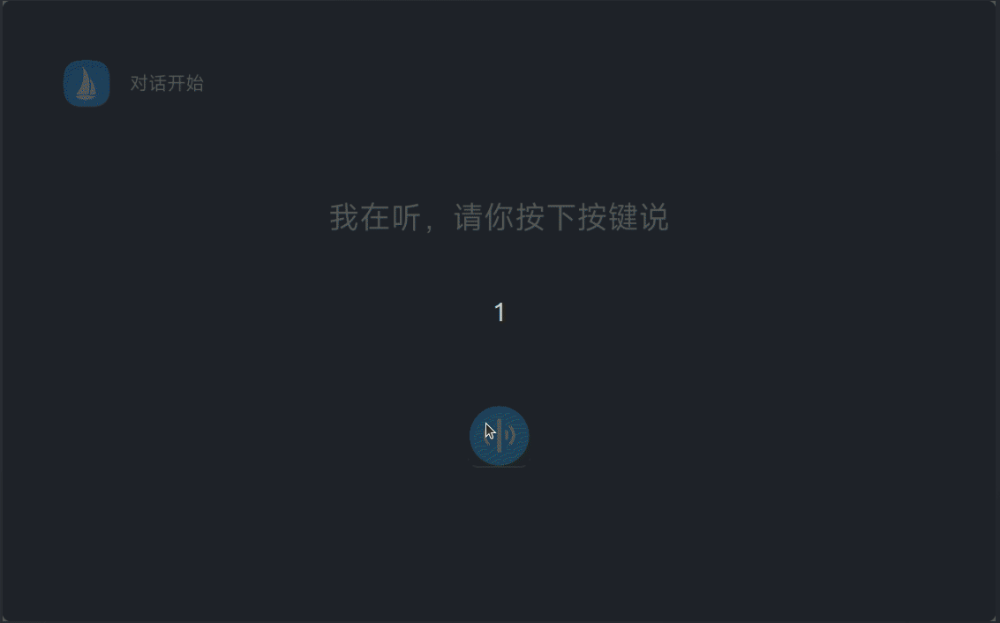
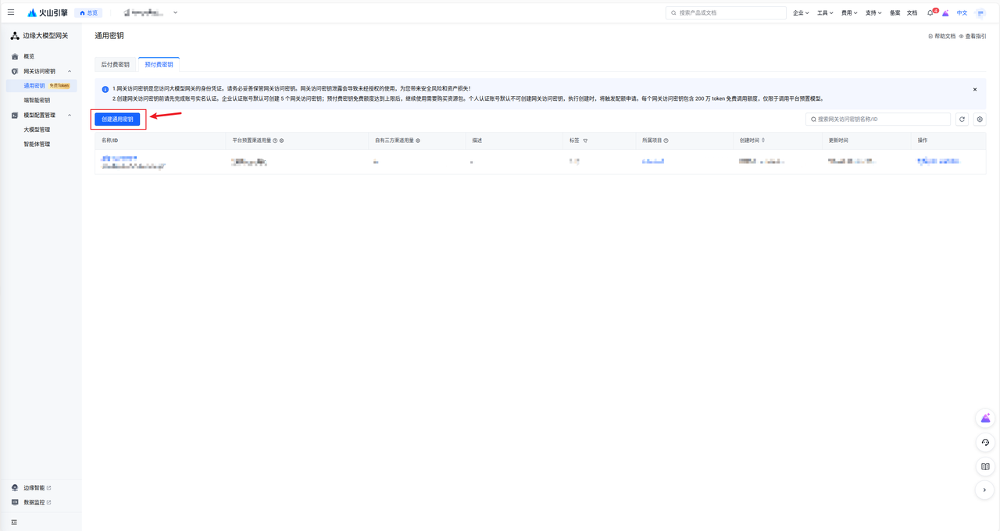
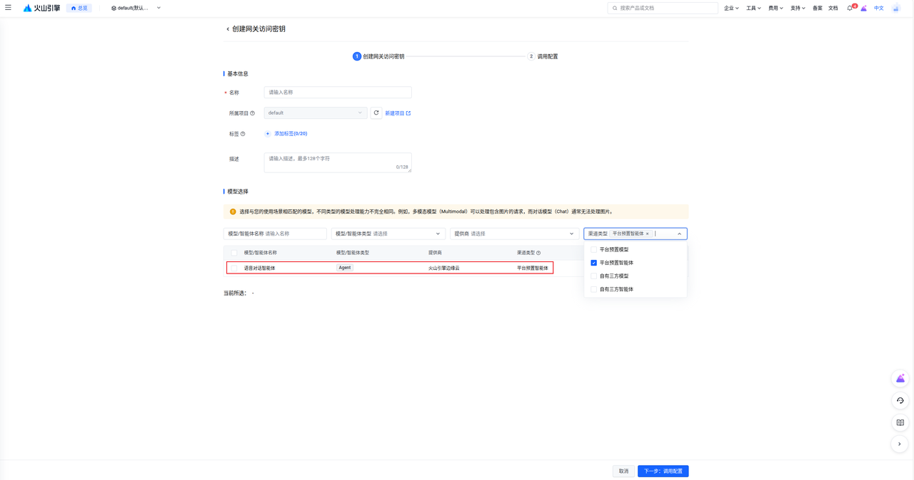

# AI Chat Demo 使用说明
## **Demo 演示**



## **1. 运行环境与依赖**

\- **基础组件**：选择 \`CONFIG\_AI\_CONVERSATION\_DEMO\` 后会自动 \`select\` MEDIA、MEDIA\_SERVER、LIBUV\_EXTENSION、LIB\_JSONC、CRYPTO\_MBEDTLS、OPENSSL\_MBEDTLS\_WRAPPER、NETUTILS\_LIBWEBSOCKETS 等依赖。确保存量镜像已包含相关库与驱动。

\- **硬件需求**：设备需具备麦克风输入（默认流名 \`Capture\`）和扬声器输出（默认流名 \`Music\`），并能访问外网。

\- **资源文件**：UI 依赖字体、图标、音乐资源，需放置在配置路径下（详见第 3 节）。

\- **Volc API Key**：需向火山引擎申请实时对话 API Key，并写入配置项。

## **2. menuconfig 选项**

### **2.1 主体功能**

```plain&#x20;text
AI_CONVERSATION_DEMO=y

# AI_CONVERSATION_DEMO 有对应依赖，需要打开对应依赖
MEDIA=y
MEDIA_SERVER=y
LIBUV_EXTENSION=y
LIB_JSONC=y
CRYPTO_MBEDTLS=y
OPENSSL_MBEDTLS_WRAPPER=y
NETUTILS_LIBWEBSOCKETS=y

AI_VOLC_PLUGIN=y
VOLC_PULGIN_API_KEY=开发者自己申请的key
AI_CONVERSATION_RECORDER_STREAM=cap
```

### **2.2 媒体与 GUI 参数**

| 配置项                                      | 说明       | 默认值         | 建议                       |
| ---------------------------------------- | -------- | ----------- | ------------------------ |
| `CONFIG_AI_CONVERSATION_RECORDER_STREAM` | 麦克风流名    | `"Capture"` | 模拟器上使用'cap'              |
| `CONFIG_AI_CONVERSATION_GUI_ROOT`        | 资源根目录    | `/data`     | 依据挂载点调整                  |
| `CONFIG_AI_CONVERSATION_GUI_RES_PATH`    | 根目录下资源路径 | `/res`      | 通常保持默认                   |
| `CONFIG_AI_CONVERSATION_GUI_FONT_PATH`   | 字体路径     | `/fonts`    | 确认包含 `MiSans-Normal.ttf` |
| `CONFIG_AI_CONVERSATION_GUI_ICONS_PATH`  | 图标路径     | `/icons`    | 需要 `app.png`             |
| `CONFIG_AI_CONVERSATION_GUI_PRIORITY`    | 线程优先级    | `100`       | 视系统负载调整                  |
| `CONFIG_AI_CONVERSATION_GUI_STACKSIZE`   | 栈大小      | `32768`     | 复杂 UI 可适当增大              |

> 若保持默认路径，则字体实际路径为 `/data/res/fonts/MiSans-Normal.ttf`，图标为 `/data/res/icons/app.png`。

## **3. 资源准备**

1. 将字体、图标、音乐等文件同步到 `CONFIG_AI_CONVERSATION_GUI_ROOT + CONFIG_AI_CONVERSATION_GUI_RES_PATH` 对应的目录。

2. 音乐文件需匹配源码中的映射：例如 `res/music/daoxiang.mp3`、`qinghuaci.mp3`、`Kgezhiwang.mp3`、`tongzhuodeni.mp3` 等。

3) 若需新增 UI 资源，可在相同目录补充文件并修改代码里的文件名。

```plain&#x20;text
# 安装adb
sudo apt install android-tools-adb

# 推送资源
adb push apps/packages/demos/ai_chat/res /data/
```

## **4. 运行demo**

```plain&#x20;text
ifup eth0
renew eth0
ai_conversation &
```

## **5. AI 对话服务插件开发**

后续我们会基于插件接入更多的云端服务，想自行接入的开发者请参考该文档。

[AI Chat Demo 插件开发指南](PLUGIN_DEVELOPMENT.md)


## **火山 key 的申请**

### 参考文档

[语音对话智能体--边缘智能-火山引擎](https://www.volcengine.com/docs/6893/1389041?lang=zh)

### **1. 进入边缘大模型网关**



### **2. 申请语音对话智能体的 key**



