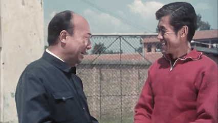
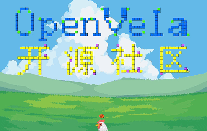
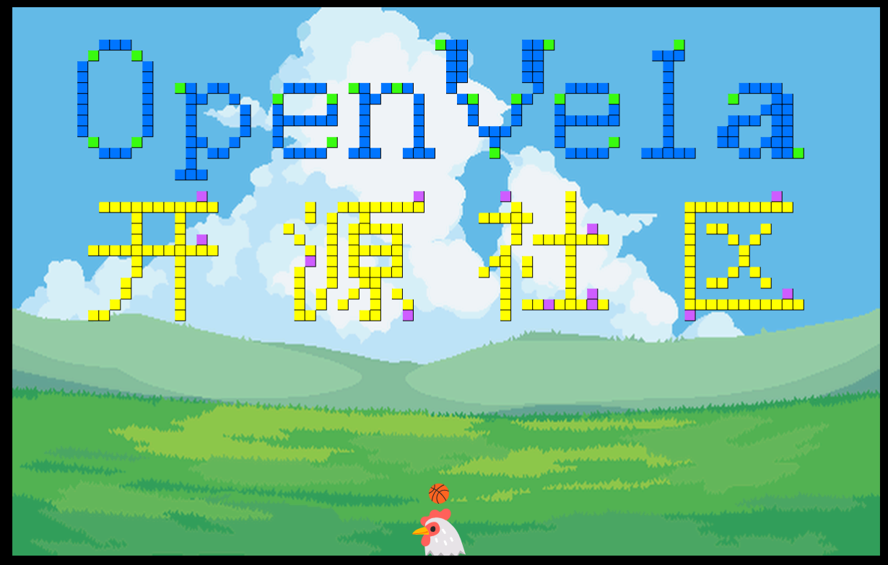
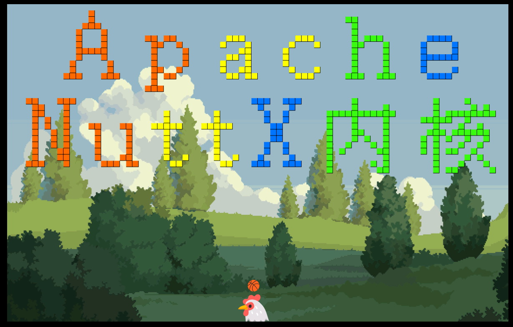

# 🎮 Breakout Game 《打砖块游戏v3.2》
`“KUN生是旷野,不是轨道!”` 拥有对篮球无限热爱的KUN，在家族中独树一帜，正挥洒着汗水，勤奋努力的击打篮球撞碎砖块，缔造属于自己的篮球哲学。 


🧱 开发时长不足`两年半`的作品，是基于OpenVela和LVGL开发的触屏打砖块游戏，将篮球和鸡融合到一起，已实现了基本游戏逻辑，增加了图片素材并实现了打击音效。


**本项目中的图片及音频资源已按要求遵守相应的许可协议，可用于个人作品及商业用途。**
在对应素材文件夹下，已通过`readme`和`LICENSE`文件详细标明了作者出处等信息，满足了相应的license协议要求，允许个人在作品及商业中使用，但不得对素材进行单独售卖。

**最新公告V3.2 修复球类bug,增加通关道具**

**修复球类运动方向问题的bug**
- 现在道具获得的小球，会正确的向左或向右发射

**在少于15个方块时掉落，终结剩余方块的通关道具TROPHY**
- 可以跳过一段不愉快的时光。

以下是实机画面：

以下是第三版游戏部分界面：



# ✨ Features 特点

- **游戏区域**：使用 LVGL 创建全屏的游戏区域，并支持动态生成砖块。
- **挡板与球的物理机制**：挡板通过触摸输入进行控制，球的运动具有物理效果，碰撞后反弹。
- **砖块系统**：砖块具有血量，可被破坏，支持不同类型砖块的行为。
- **音效反馈**：根据砖块的血量播放不同的音效。
- **触摸输入**：支持触摸屏输入来控制挡板移动。
- **道具系统**: 支持增长挡板，分裂小球等功能。
- **游戏状态管理**：管理游戏状态（例如：PLAYING、GAME_OVER、PAUSED）以控制游戏流程。


# 🖼️ Image Handling（图片处理）
## 1. libpng decoder（libpng 解码器）
好消息，OpenVela系统已经内置了该PNG解码器，仅需将`LIB_PNG`和`LV_USE_LIBPNG`配置为`yes`，即可轻松使用`lv_image_set_src`等函数读取使用`PNG`图片。使用方法可以参考：`https://lvgl.100ask.net/master/details/libs/libpng.html`
此外，这是libpng的github仓库链接：`https://github.com/pnggroup/libpng`，自己手动引入还是有难度。

## 2.Image Caching（图片缓存）
LVGL 支持将图像缓存到内存中，以提升图像组件在运行时的加载速度，特别适用于反复绘制的图像场景，如游戏背景、按钮图标等。
在从外部读入图片过多，会有明显卡顿，可以使用图片缓存的方法，将图片读入内存。具体可以参考：`https://lvgl.100ask.net/master/details/main-components/image.html#overview-image-caching`

# 🔊 Audio Handling（音频处理）
引用了`packages_demos`仓库下的`music_player`的音频控制文件`audio_ctl.c`和`audio_ctl.h`，通过`audio_ctl_init_nxaudio`加载音频文件，`audio_ctl_start`播放音频，`audio_ctl_stop`暂停音频，`audio_ctl_uninit_nxaudio`释放资源，实现了碰撞砖块发出音效。


# 🚀 Getting Started 快速开始

首先进入模拟器配置
## 1.配置模拟器（menuconfig）
```bash
./build.sh vendor/openvela/boards/vela/configs/goldfish-armeabi-v7a-ap menuconfig
```

使用`/`键进入搜索模式
- 配置`LVX_USE_DEMO_BREAKOUT `为 `yes`
- `LVX_BREAKOUT_DATA_ROOT`的路径设置为`/data `  (Kconfig文件默认预设为 `/data`)
- `LVX_BREAKOUT_STACKSIZE`设置为65536 
- `LIB_PNG`和`LV_USE_LIBPNG`配置为`yes`   (读取png图片资源)
- `AUDIO`和`AUDIOUTILS_NXAUDIO_LIB`配置为`yes`  (读取wav音频文件)
- `Default image header cache count`配置为`18`   （缓存图片数）
- `Default image cache size`配置为`8388608` ，这一步设定图片内存8MB，实测只用了大概3648003，不到4MB，设为8MB这样保险一些。**在配置后，一定要先`清理构建产物`，再`重新构建`，否则`image cache max size`不会更新。**
## 2.构建和清除构建文件
### 开始构建
```bash
./build.sh vendor/openvela/boards/vela/configs/goldfish-armeabi-v7a-ap -j$(nproc)
```
### 清理构建产物
```bash
./build.sh vendor/openvela/boards/vela/configs/goldfish-armeabi-v7a-ap distclean -j$(nproc)
```
## 3.ADB推送更新关卡等资源（在模拟器运行状况下）
```bash
adb push apps/packages/demos/breakout/res /data/
```

## 4.启动模拟器
```bash
./emulator.sh vela
```

## 5.启动游戏
```bash
breakout &
```
---
#  ▶️ 启动游戏

在 main文件函数中初始化 LVGL后，调用：

ballgame_start(); // 启动游戏


# 🎮 Controls

- 移动挡板：按住并拖动屏幕，挡板随手指水平移动。

- 发射小球：游戏开始时，轻触屏幕即可发射小球。

- 重新开始：掉球后点击 "Restart" 按钮重开一局。

# 📄 Level File Format (.dat)

放置关卡文件：
将 .dat 文件放到资源路径下，例如：

    `breakout/res/map/level_1.dat`

关卡文件为文本格式，使用字符描述砖块：
| 字符 | 说明           | 生命值 |
|------|----------------|--------|
| 空格 | 空(无生成)     | 无     |
| `#`  | 墙（不可破坏） | -1     |
| `A`  | 绿色砖块       | 1      |
| `B`  | 橙色砖块       | 2      |
| `C`  | 紫色砖块       | 3      |
| `D`  | 黄色砖块       | 4      |
| `E`  | 蓝色砖块       | 5      |
| 未知类型 | 绿色砖块  | 1     |

此处读取文件时，会将换行符`\n`,制表符`\r`,文件结尾符号`\0`也识别出来，需要注意排除。

关卡示例：
```
#######
#A B A#
#  C  #
#######
```
**V3.0增加了三个充满激情的buff道具**
- 可以呼朋引伴的友情魔法
- 让篮球无丝分裂的奇妙技艺
- 与朋友们一起发射篮球的友谊力量
**好好运用，相信你一定能战胜砖块!(๑•̀ㅂ•́)و✧**

**V3.1 球绘制方法更新概述**
**旧版（每球独立对象)**
- 每个球都是一个独立的 LVGL 对象。
- 每帧通过 lv_obj_set_pos 移动对象。
- 球多时容易卡顿，对象管理开销大，频繁创建销毁对象成本高。

**新版（统一 Canvas 绘制)**
- 创建一个覆盖游戏区域的 canvas。
- 所有球每帧绘制到同一个 canvas 上。
- 每帧只需刷新一次 canvas（先填充背景去除拖影，再绘制球的新位置）。
- 显著降低对象管理开销，提升多球场景下的刷新性能。


# 素材使用说明
- 素材来源于`https://icon.sucai999.com/`以及`https://craftpix.net`
- 道具图标来源于`game-icons.net`
- 音频素材来源于`https://freesound.org/`

**本项目中的图片及音频资源已按要求遵守相应的许可协议，可用于个人作品及商业用途，但不得对素材单独进行售卖。**

- **Microsoft 图片**：可在个人及商业项目中使用，需遵守 **MIT** 许可协议。
- **Google 图片**：可在个人及商业项目中使用，需遵守 **Apache 2.0** 许可协议，并附带版权声明、许可证文本及修改声明。
- **CraftPix.net 图片**：可用于个人及商业项目，但需遵守 **CraftPix 自定义许可协议**，保留版权信息并不得单独转售源文件。
- **game-icons.net图标**：可用于个人及商业项目，但必须 署名原作者，并标明许可协议；允许修改、分发和再使用，但不得去除作者署名。
- **freesound音频**：本作品使用的音频文件皆为 **CC0（Creative Commons 0）** 授权的资源，表示该资源已被作者明确放弃所有版权及相关权利，可自由复制、修改、分发，亦可用于个人或商业用途，无需署名、无需许可、无任何限制。
 
