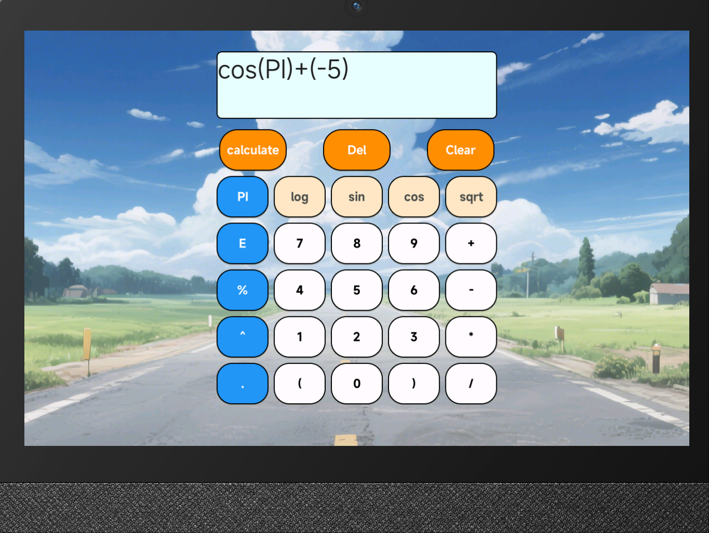

# 高级计算器 - 基于 open-vela

## 📚 目录

- [一、基本介绍](#一基本介绍)  
  - [1.1 基本四则运算](#1-基本四则运算)  
  - [1.2 高级计算支持](#2-高级计算支持)  
  - [1.3 结果后输入智能处理](#3-结果后输入智能处理)  

- [二、实现思路](#二实现思路)  
  - [2.1 Token 级别与运算符优先级](#1-token-级别与运算符优先级)  
  - [2.2 表达式解析](#2-表达式解析)  
  - [2.3 逆波兰表示法计算](#3-逆波兰表示法计算)  
  - [2.4 基于 LVGL 使用 create_button() 动态创建按键](#4-基于-lvgl-使用-create_button-动态创建按键)  
  - [2.5 输入保护机制](#5-输入保护机制)  

- [三、使用说明](#三使用说明)  
  - [3.1 配置模拟器（menuconfig）](#1配置模拟器menuconfig)
  - [3.2 makefile 编译问题](#2makefile编译问题)  
  - [3.3 资源推送更新 /res](#3资源推送更新-res)  

- [📁 原工程路径](#原工程路径)  
- [🛠️ 常用指令](#常用指令)

---
## 一、基本介绍

- 基于 open-vela，制作了一个 **高级计算器**，
- 计算器函数部分引用自仓库https://github.com/W-Mai/ExpressionCalc
- 其中 calculate是计算结果，Clear是清屏，Del是退位。
- sqrt以及cos等函数需要加括号使用，常量PI和E可以直接使用。
例如 PI / 2 、 E + 4 、sqrt(4) 、cos(-2)



该计算器实现了以下功能：

### 1. 基本四则运算

- 支持加、减、乘、除运算
- 运算支持 double 精度，仅显示有效数字，不显示多余的 `0`  
- 例如：显示 `1.5`，而不是 `1.50000000`

### 2. 高级计算支持
使用方法。例如 cos(2)

- sqrt    平方根（√）
- log	自然对数（ln）
- sin	正弦函数
- cos	余弦函数
- PI	圆周率 π	3.1415926...
- E	自然常数 e	2.7182818...
- .       小数点
- (	左括号
- )	右括号

### 3. 结果后输入智能处理

- 运算结果显示后，再次输入新数字会自动清屏
- 如果输入的是运算符，则保留结果并继续运算
---

## 二、实现思路

### 1. Token 级别与运算符优先级

- 通过 TokenLevel 来定义每个操作符的优先级。例如，+ 和 - 的优先级是 1，而 *, /, % 等是 2。

- 这样就能在处理逆波兰表示法时判断操作符的优先级，确保正确的运算顺序。


### 2. 表达式解析
- reversePolishNotation 方法负责将输入的中缀表达式（例如 a + b * c）转换为逆波兰表示法（如 a b c * +）。这个过程使用了栈来处理操作符和括号。

- 当遇到数字时，直接将其添加到结果队列。

- 当遇到操作符时，根据其优先级判断是否需要弹出栈中的操作符。

- 遇到左括号 ( 时，压入栈中，右括号 ) 时，弹出栈中的操作符直到遇到左括号。


### 3. 逆波兰表示法计算

- evalNotation 方法通过栈来计算逆波兰表示法的结果。

- 如果遇到数字，将其压入栈中。

- 如果遇到运算符，从栈中弹出参数并进行计算，然后将结果压回栈中。

- 支持的运算符可以是自定义的，也可以是内置的，如 +, -, *, sin, log 等。


### 4. 基于 LVGL 使用 `create_button()` 动态创建按键

- 通过 `create_button()` 函数动态创建按键

- 使用二维 `btn_map` 配置按钮排布，便于维护和扩展

- 使用 LVGL 的组件函数设置按钮及输入框，设定合理设置尺寸和位置，颜色

### 5. 输入保护机制

- 输入非法或不符合规则（如多个 `.`、负数开根号、除以零等）时，运算显示 `ERROR`

- 删除、清除、错误重置等操作处理完善，确保系统稳定运行

---


## 三、使用说明
首先进入模拟器配置
### 1.配置模拟器（menuconfig）
```bash
./build.sh vendor/openvela/boards/vela/configs/goldfish-armeabi-v7a-ap menuconfig
```
#### (1)编译设置
- 配置LVX_USE_DEMO_CALCULATOR 为 yes
- LVX_CALCULATOR_DATA_ROOT的路径设置为/data   (Kconfig文件默认预设为 /data)

#### (2)使用C++头文件需要配置
进行以下操作设置，以支持C++编写include头文件，例如iostream.h,cmath.h
- 设置 C++ library为 Toolchain C++ support
- 设置 C++ low level library select 为 GNU low level libsupc++
- 设置  (gnu++20) Language standard

如果使用异常处理机制try-catch，需要开启以下设置（嵌入式中不推荐，当前版本已不使用该机制）
- enable exception support


### 2.makefile编译问题
#### (1)编译找不到Main函数

```
arm-none-eabi-ld: /home/foam/vela-opensource/nuttx/staging/libapps.a(builtin_list.c.home.foam.vela-opensource.apps.builtin_1.o):(.rodata.g_builtins+0x7c): undefined reference to calculator_main'
```
- 因为makefile文件中的PROGNAME = calculator
- 在编译时会试图链接一个函数名叫：int calculator_main(int argc, char *argv[])
- 并且还需要加上extern "C" ，所以得到主函数为extern "C" int calculator_main 才能成功编译。

#### (2)makefile编写
- 因为使用了cpp文件，所以需要增加CXXEXT以指出.cpp格式文件
```
CXXEXT := .cpp
```
- 并且C++文件需要使用CXXSRCS标出，如
```
CXXSRCS = calculator_cre.cpp expression_calc.cpp 
```

### 3.资源管理方式

#### (1) 内置资源模式（推荐，默认启用）
在 menuconfig 中启用 `use the builtin resources` (默认为 `y`)：
- 字体和图片编译到固件中，无需额外推送
- elf会增大
- 优点：部署简单，无需 adb 推送
- 适用场景：生产环境、快速测试

#### (2) 文件系统资源模式
在 menuconfig 中禁用 `use the builtin resources` (设置为 `n`)：
- 需要在模拟器运行状况下，使用 ADB 指令推送资源：

启动模拟器：
```bash
./emulator.sh vela
```

ADB推送更新资源（在模拟器运行状况下）：
```bash
adb push apps/packages/demos/calculator/res /data/
```

启动计算器应用：
```bash
calculator &
```

- 优点：可动态更换资源，ROM 占用小
- 适用场景：开发调试、频繁更换 UI 资源


## 📁原工程路径
vela-opensource/apps/packages/demos/calculator/

---

## 🛠️常用指令

### 开始构建

```bash
./build.sh vendor/openvela/boards/vela/configs/goldfish-armeabi-v7a-ap -j$(nproc)
```
### 配置模拟器（menuconfig）
```bash
./build.sh vendor/openvela/boards/vela/configs/goldfish-armeabi-v7a-ap menuconfig
```

### ADB推送更新资源（使用文件系统资源模式，在模拟器运行状况下）
```bash
adb push apps/packages/demos/calculator/res /data/
```

### 清理构建产物
```bash
./build.sh vendor/openvela/boards/vela/configs/goldfish-armeabi-v7a-ap distclean -j$(nproc)
```
### 启动模拟器
```bash
./emulator.sh vela
```

### 启动计算器应用
```bash
calculator &
```
---


