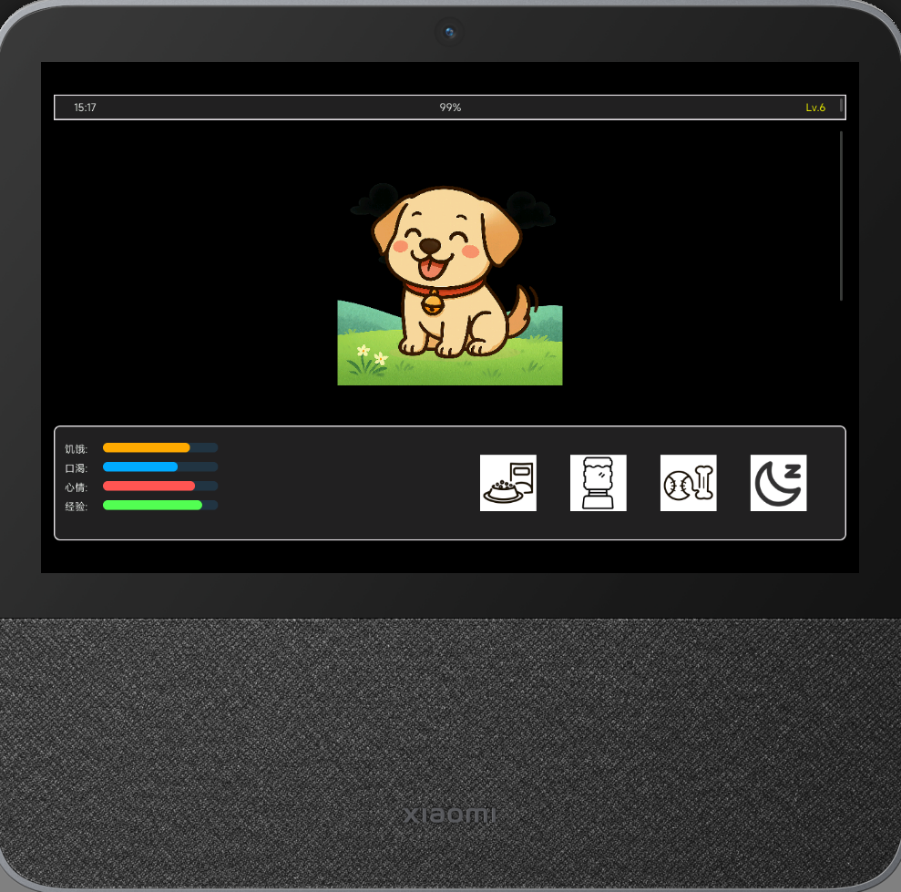
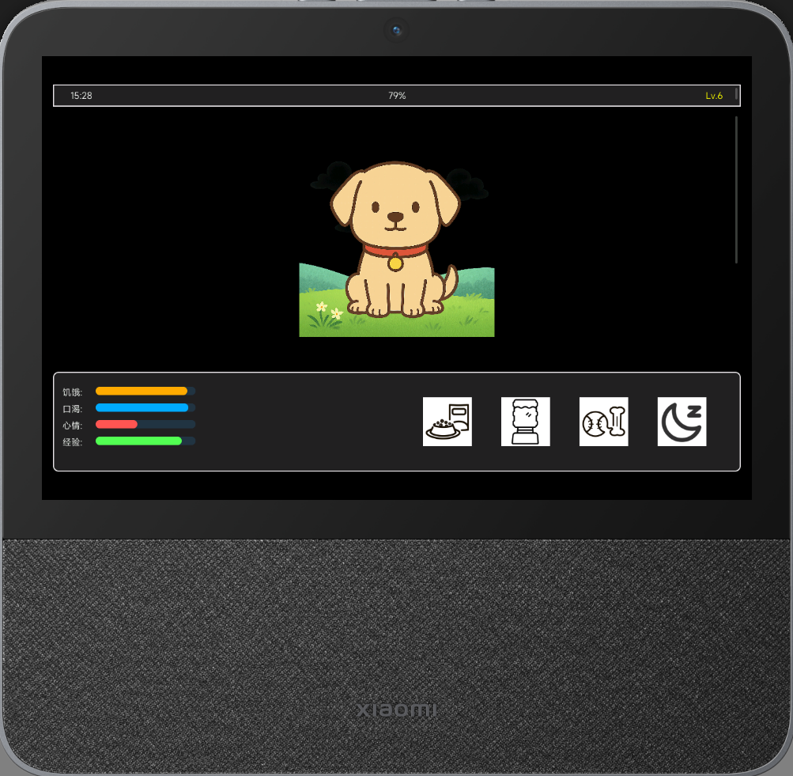
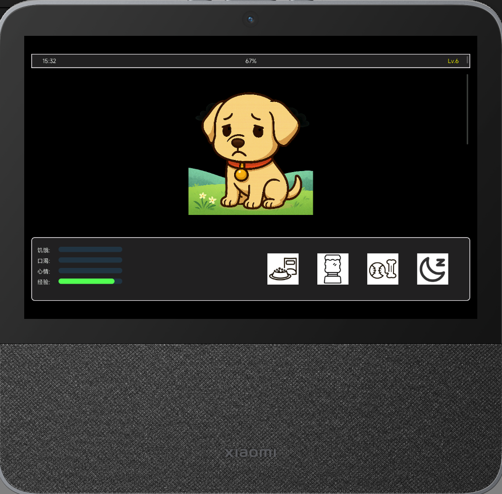

# 虚拟宠物应用 (Virtual Pet Demo)

## 简介

虚拟宠物应用是一个基于LVGL图形库的交互式演示程序，模拟了一个数字宠物的饲养过程。用户可以通过喂食、饮水、运动和休息等操作来照顾虚拟宠物，提升其心情和等级。

## 界面预览



*主界面：左侧显示宠物状态，右侧为操作按钮*




*宠物的不同情绪状态：开心、平静、难过*

## 功能特性

### 宠物状态管理
- **饥饿度**：随时间缓慢下降，可通过喂食恢复
- **口渴度**：随时间缓慢下降，可通过饮水恢复
- **心情值**：受饥饿度和口渴度影响，可通过运动提升
- **经验值**：随时间自动增长，运动可获得额外经验值
- **等级系统**：积累足够经验值后升级

### 宠物状态表现
- **三种情绪状态**：开心、平静、难过（根据心情值自动变化）
- **睡眠状态**：可手动切换，睡眠时状态下降更慢，心情缓慢恢复

### 成就系统
- 连续7天喂食/饮水/运动
- 存活30天
- 达到5级/10级

### 数据持久化
- 自动保存宠物数据
- 应用重启后可恢复之前的状态

### 用户界面
- 现代化UI设计，左侧状态面板，右侧操作按钮
- 图形化按钮，带有点击反馈效果
- 状态条直观显示宠物各项属性

## 使用方法

### 基本操作
1. **喂食**：点击食物图标，增加饥饿度和少量心情值
2. **饮水**：点击水杯图标，增加口渴度和少量心情值
3. **运动**：点击运动图标，大幅提升心情值并获得额外经验，但会消耗饥饿度和口渴度
4. **睡眠**：点击睡眠图标，切换宠物睡眠状态，睡眠时状态下降更慢

### 状态指示
- 左侧进度条显示宠物的饥饿度、口渴度、心情值和经验值
- 宠物图像会根据心情状态变化
- 顶部状态栏显示当前时间、电量和宠物等级

## 配置与编译

### 依赖项
- LVGL图形库
- NuttX操作系统
- libuv事件循环库

### 编译选项
在NuttX配置中启用：
```
CONFIG_LVX_USE_DEMO_PET=y
CONFIG_LVX_PET_DATA_ROOT="/data"  # 设置资源文件路径
```

## 资源文件结构
```
/data/res/
  ├── fonts/        # 字体文件
  ├── image/        # 宠物和背景图像
  └── icons/        # 操作按钮图标
```

## 开发者信息

### 主要文件
- `pet.h`：定义结构体和常量
- `pet.c`：实现主要功能
- `pet_main.c`：应用入口和LVGL初始化

### 扩展建议
- 添加更多互动方式
- 实现随机事件系统
- 增加更多成就和奖励
- 添加社交功能