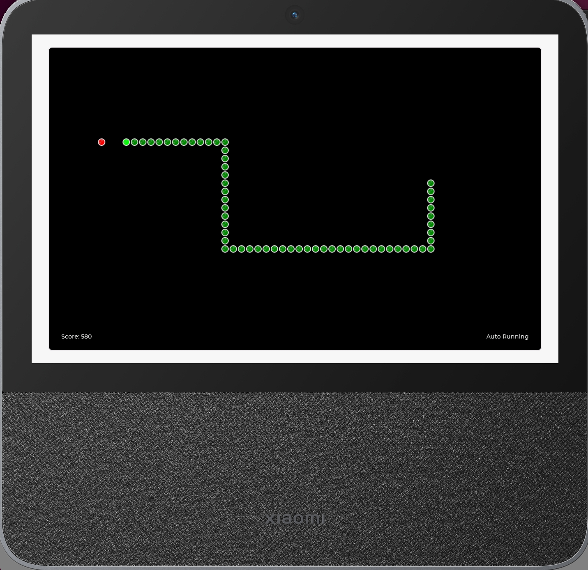
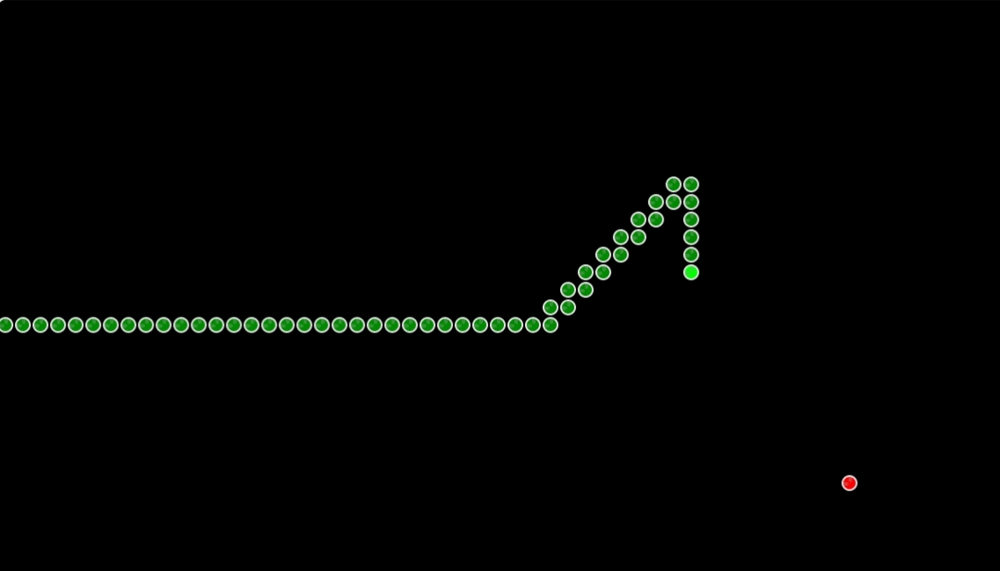
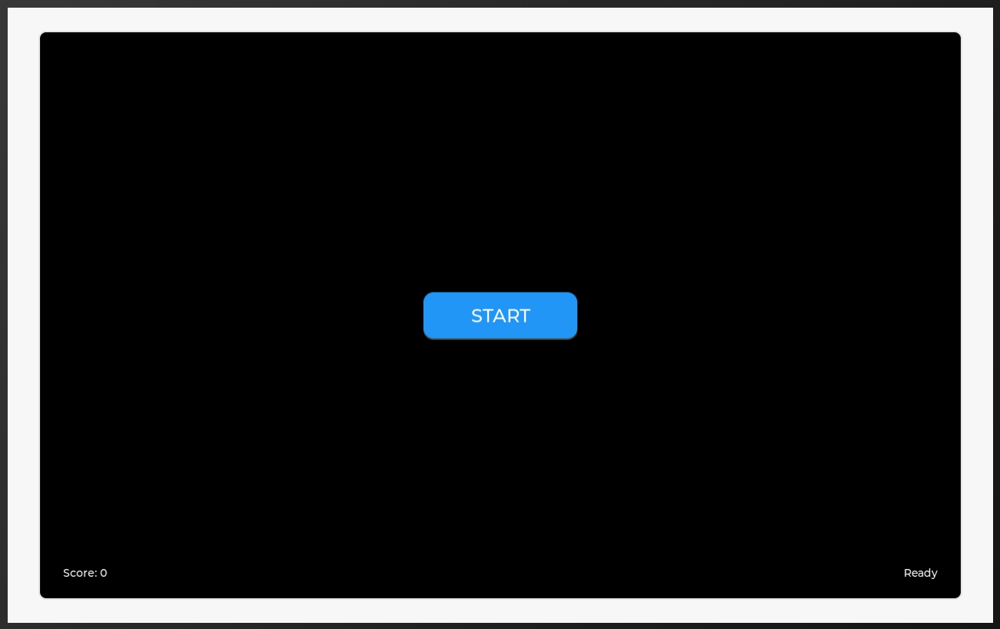
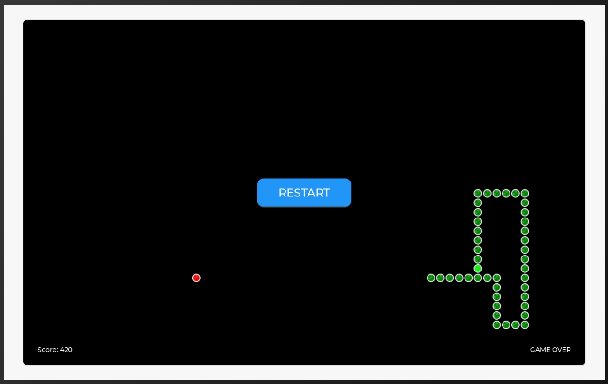

# Snake Game

## Introduction

This is an automatic snake game implemented using the LVGL graphics library. The game area is a 60×35 grid, with each grid cell being 20×20 pixels.

### Features

- Click "START" button to begin the game
- After clicking start, the snake automatically searches for and eats food
- Reach 1000 points to win, displaying "Victory!"
- Game ends when hitting self or wall, displaying "GAME OVER"
- "RESTART" button appears when game ends
- Real-time score display
- Random food generation
- Snake head is bright green, body is dark green






## Configuration

1. Switch to the openvela repository root directory and execute the following command to configure the snake game:

    ```Bash
    ./build.sh vendor/openvela/boards/vela/configs/goldfish-armeabi-v7a-ap menuconfig
    ```

2. Press `/` to search and modify the following configurations:

    ```Bash
    LVX_USE_DEMO_SNAKE_GAME=y
    LVX_SNAKE_GAME_DATA_ROOT="/data"
    ```

## Compilation

```Bash
# Clean build files
./build.sh vendor/openvela/boards/vela/configs/goldfish-armeabi-v7a-ap distclean -j$(nproc)

# Start compilation
./build.sh vendor/openvela/boards/vela/configs/goldfish-armeabi-v7a-ap -j$(nproc)
```

## Running

1. Start the emulator:

    ```Bash
    ./emulator.sh vela
    ```

2. In the emulator terminal environment `openvela-ap>`, enter:

    ```Bash
    snake_game &
    ```

## Game Rules

- Click "START" button to begin the game
- Snake automatically finds the shortest path to food
- Each food eaten scores 10 points
- Game ends when hitting self or wall, displaying "GAME OVER"
- Click "RESTART" button to start a new game when game ends
- Reach 1000 points to win, displaying "Victory!"

## Operation Guide

1. **Start Game**:
   - Click the "START" button in the center of the screen
   - Button automatically hides after game starts

2. **During Game**:
   - Snake automatically searches for food and moves
   - Score displayed in top left corner
   - Game status shown in top right corner

3. **Game End**:
   - Game ends when snake hits itself or wall, displaying "GAME OVER"
   - Victory achieved at 1000 points, displaying "Victory!"
   - "RESTART" button appears in screen center
   - Click "RESTART" to begin a new game

## Technical Implementation

The game uses a linked list structure to store the snake's body and implements automatic movement through a timer. The snake calculates the shortest path to food (considering turnaround situations) and automatically chooses the optimal movement direction. The game uses LVGL's canvas component for rendering, redrawing the entire screen after each move. The game interface features a clean design with prominent control buttons and status displays.

